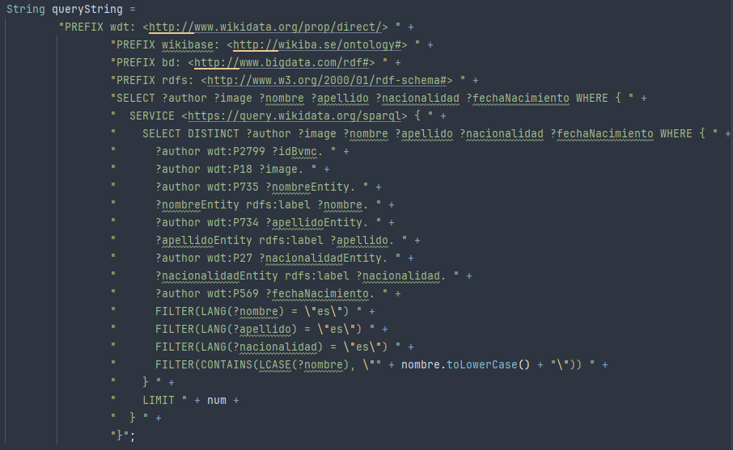

# Biblioteca Virtual con SPARQL y Wikidata

¡Bienvenido al proyecto de **Biblioteca Virtual con SPARQL y Wikidata**! Este es un proyecto backend desarrollado en **Java Spring Boot** que permite explorar y consultar información sobre libros, autores y publicaciones utilizando datos enlazados de [Wikidata](https://www.wikidata.org/) mediante consultas SPARQL. 
 📌 **Este proyecto se desarrolla en la Universidad de Alicante como parte del Máster en Desarrollo de Aplicaciones y Servicios Web (DASW).**

## Resumen del Proyecto

Este proyecto es una aplicación Spring Boot que actúa como intermediario entre el usuario y la base de conocimientos de Wikidata. 
Utiliza consultas SPARQL para recuperar datos estructurados sobre libros (títulos, autores, fechas de publicación, géneros, etc.). 

## Autores

- **Francesc Miquel Obrador Artigues**  
- **Marco Sarrió Ferrández**

## Capturas
### Código SPARQL

### Interfaz final

